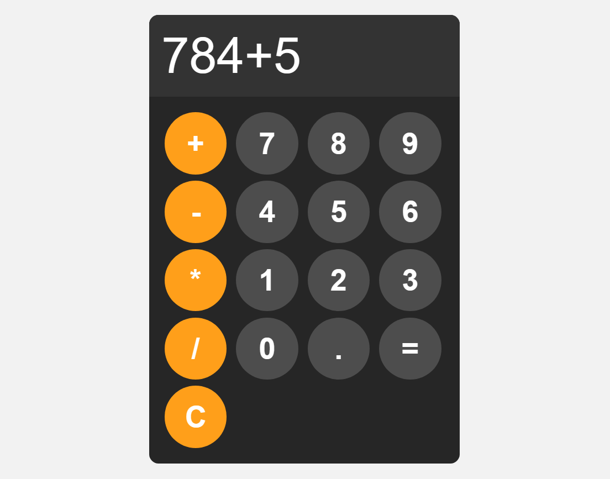

# 🧮 Simple Calculator

A simple and responsive calculator built using **HTML**, **CSS**, and **JavaScript**. This project performs basic arithmetic operations such as addition, subtraction, multiplication, and division.

---

## 📸 Preview

  
*(Optional: Add a screenshot of your calculator UI here)*

---

## ✨ Features

- Basic arithmetic operations (+, −, ×, ÷)
- Clean and responsive UI
- Light-weight and beginner-friendly code

---

## 🛠️ Built With

- 💻 HTML5  
- 🎨 CSS3  
- ⚙️ JavaScript (Vanilla)
